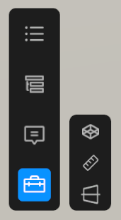

# Explore the Tool Options menu

The tool options, represented by a briefcase icon, allow you to access various tools for asset manipulation and interaction.

*The tool options icon in the Industry Viewer Template.*

## Environment

Use the environment option to swap between different scene environments. This allows you to view your asset in different lighting conditions and settings.

Refer to [Customize scene environments](../project-settings-customization/feature-management/scene-environments.md) for more information on adding and managing scene environments.

## Measure tool

The measure tool allows you to measure distances within the 3D scene. You can use it to get accurate measurements between different points on your asset.

Use the **Units** drop-down to select your preferred measurement units, such as meters or feet.

Use the **Mode** drop-down to select between the following options:

| **Property** | **Description** |
| :---- | :---- |
| **Two-Points** | Measure the distance between two points by selecting them in the 3D scene. |
| **Orthogonal** | Measures the direct distance between two points along a single axis. For example, to measure the height of a room, select a point on the floor and the tool will automatically find the corresponding point on the ceiling to complete the measurement.|

## Section Cut tool

The Section Cut tool enables you to create cross-sections of your 3D asset, allowing you to view its internal structure. This can be useful for analyzing complex models or for presentation purposes.

You can define a cutting plane and adjust its position and orientation to reveal different parts of the asset using the options **Move**, **Rotate**, and **Scale** tabs.

Use the **Reset** button to revert the section cut to its original state.